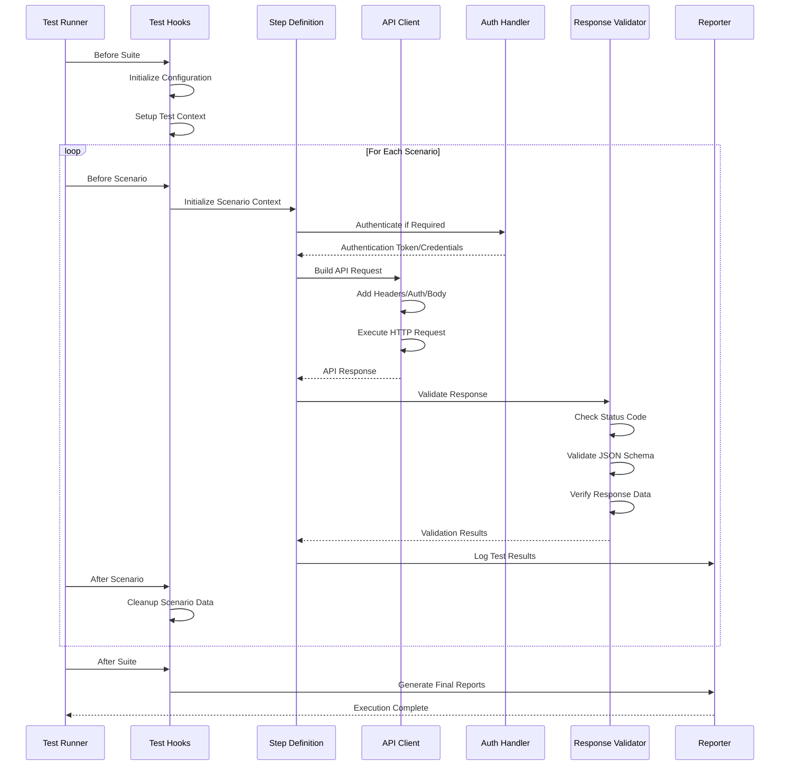

# API Test Automation Framework Architecture Plan

## Table of Contents
1. [Framework Overview](#framework-overview)
2. [Core Architecture](#core-architecture)
3. [Project Structure](#project-structure)
4. [Implementation Plan](#implementation-plan)
5. [Technology Stack](#technology-stack)
6. [Framework Features](#framework-features)
7. [Configuration Strategy](#configuration-strategy)
8. [Test Execution Flow](#test-execution-flow)
9. [Reporting Strategy](#reporting-strategy)
10. [Development Guidelines](#development-guidelines)

## Framework Overview

This is a **hybrid BDD/TDD API testing framework** built with Maven, Java, and Cucumber, designed for comprehensive REST API testing with JSON responses, authentication support, parallel execution, and dual reporting capabilities.

### Key Objectives
- Support both Behavior Driven Development (BDD) and Test Driven Development (TDD)
- Test REST APIs with full CRUD operations (GET, POST, PUT, DELETE)
- Handle Bearer Token and Basic Authentication
- Enable parallel test execution for efficiency
- Provide data-driven testing capabilities
- Generate comprehensive reports (Extent Reports + Cucumber Reports)
- Support multiple environments with configuration management

## Core Architecture

```mermaid
graph TB
    A[Test Automation Framework] --> B[Core Components]
    A --> C[Test Layers]
    A --> D[Utilities & Helpers]
    A --> E[Configuration & Data]
    A --> F[Reporting & Logging]
    
    B --> B1[API Client Manager]
    B --> B2[Authentication Handler]
    B --> B3[Request Builder]
    B --> B4[Response Validator]
    
    C --> C1[BDD Layer - Cucumber]
    C --> C2[TDD Layer - TestNG/JUnit]
    C --> C3[Step Definitions]
    C --> C4[Test Runners]
    
    D --> D1[Data Providers]
    D --> D2[Assertion Utilities]
    D --> D3[File Readers]
    D --> D4[Test Context Manager]
    
    E --> E1[Environment Properties]
    E --> E2[Test Data - JSON/YAML]
    E --> E3[Configuration Manager]
    
    F --> F1[Extent Reports]
    F --> F2[Cucumber Reports]
    F --> F3[Logging Framework]
```



## Project Structure

```
api-test-framework/
├── pom.xml
├── README.md
├── src/
│   ├── main/java/
│   │   └── framework/
│   │       ├── core/
│   │       │   ├── ApiClient.java
│   │       │   ├── RequestBuilder.java
│   │       │   ├── ResponseValidator.java
│   │       │   └── TestContext.java
│   │       ├── auth/
│   │       │   ├── AuthenticationManager.java
│   │       │   ├── BearerTokenAuth.java
│   │       │   └── BasicAuth.java
│   │       ├── config/
│   │       │   ├── ConfigManager.java
│   │       │   └── Environment.java
│   │       ├── utils/
│   │       │   ├── DataProvider.java
│   │       │   ├── JsonUtils.java
│   │       │   ├── FileUtils.java
│   │       │   ├── AssertionUtils.java
│   │       │   ├── TestDataManager.java
│   │       │   └── LogManager.java
│   │       └── reporting/
│   │           └── ExtentReportManager.java
│   └── test/
│       ├── java/
│       │   ├── stepDefinitions/
│       │   │   ├── CommonStepDefinitions.java
│       │   │   └── APIStepDefinitions.java
│       │   ├── runners/
│       │   │   ├── TestRunner.java
│       │   │   └── ParallelTestRunner.java
│       │   ├── tests/
│       │   │   ├── unit/
│       │   │   └── integration/
│       │   └── hooks/
│       │       └── TestHooks.java
│       └── resources/
│           ├── features/
│           │   ├── userManagement.feature
│           │   └── authentication.feature
│           ├── testData/
│           │   ├── users.json
│           │   ├── endpoints.yaml
│           │   └── scenarios.json
│           ├── config/
│           │   ├── dev.properties
│           │   ├── staging.properties
│           │   └── prod.properties
│           └── schemas/
│               └── userSchema.json
├── target/
│   └── reports/
│       ├── extent-reports/
│       ├── cucumber-reports/
│       └── logs/
└── docs/
    └── framework-guide.md
```

## Implementation Plan

### Phase 1: Project Setup & Core Infrastructure
1. **Maven Project Setup**
   - Initialize Maven project with proper directory structure
   - Configure `pom.xml` with required dependencies
   - Setup Maven Surefire plugin for test execution
   - Configure Maven Failsafe plugin for integration tests

2. **Core Framework Components**
   - `ApiClient.java` - RestAssured wrapper for HTTP operations
   - `RequestBuilder.java` - Fluent API for building HTTP requests
   - `ResponseValidator.java` - Comprehensive response validation utilities
   - `TestContext.java` - Thread-safe context for sharing data between steps

### Phase 2: Authentication & Configuration
1. **Authentication Layer**
   - `AuthenticationManager.java` - Central authentication coordinator
   - `BearerTokenAuth.java` - JWT and custom token handling
   - `BasicAuth.java` - Username/password authentication
   - Support for multiple authentication strategies

2. **Configuration Management**
   - `ConfigManager.java` - Environment-specific configuration handler
   - `Environment.java` - Environment enumeration and switching
   - Property files for different environments (dev, staging, prod)
   - Dynamic configuration loading

### Phase 3: BDD Implementation
1. **Cucumber Integration**
   - Feature files using Gherkin syntax for business scenarios
   - `CommonStepDefinitions.java` - Reusable step definitions
   - `APIStepDefinitions.java` - API-specific step implementations
   - Background steps for common setup operations

2. **Test Runners**
   - `TestRunner.java` - Main Cucumber test runner
   - `ParallelTestRunner.java` - Parallel execution configuration
   - Tag-based test execution and filtering
   - Plugin configuration for reporting

### Phase 4: TDD Implementation
1. **Unit Tests**
   - Framework component unit tests
   - Utility class validation tests
   - Configuration management tests
   - Authentication mechanism tests

2. **Integration Tests**
   - End-to-end API workflow tests
   - Cross-functional scenario validation
   - Environment-specific integration tests
   - Performance and load testing scenarios

### Phase 5: Data Management & Utilities
1. **Test Data Management**
   - JSON/YAML test data file structures
   - `DataProvider.java` - Centralized data access utilities
   - `TestDataManager.java` - Data lifecycle management
   - Dynamic test data generation capabilities

2. **Utility Classes**
   - `JsonUtils.java` - JSON parsing and manipulation
   - `FileUtils.java` - File I/O operations
   - `AssertionUtils.java` - Custom assertion methods
   - `LogManager.java` - Centralized logging utilities

### Phase 6: Reporting & Logging
1. **Dual Reporting Setup**
   - `ExtentReportManager.java` - Extent Reports configuration
   - Cucumber native HTML report generation
   - Report aggregation and consolidation
   - Screenshot and attachment capabilities

2. **Test Hooks & Context Management**
   - `TestHooks.java` - Before/After scenario hooks
   - Test context initialization and cleanup
   - Environment setup and teardown
   - Logging and reporting integration

## Technology Stack

### Core Dependencies
```xml
<dependencies>
    <!-- BDD Framework -->
    <dependency>
        <groupId>io.cucumber</groupId>
        <artifactId>cucumber-java</artifactId>
        <version>7.14.0</version>
    </dependency>
    <dependency>
        <groupId>io.cucumber</groupId>
        <artifactId>cucumber-testng</artifactId>
        <version>7.14.0</version>
    </dependency>
    
    <!-- API Testing -->
    <dependency>
        <groupId>io.rest-assured</groupId>
        <artifactId>rest-assured</artifactId>
        <version>5.3.2</version>
    </dependency>
    <dependency>
        <groupId>io.rest-assured</groupId>
        <artifactId>json-schema-validator</artifactId>
        <version>5.3.2</version>
    </dependency>
    
    <!-- Test Framework -->
    <dependency>
        <groupId>org.testng</groupId>
        <artifactId>testng</artifactId>
        <version>7.8.0</version>
    </dependency>
    
    <!-- Reporting -->
    <dependency>
        <groupId>com.aventstack</groupId>
        <artifactId>extentreports</artifactId>
        <version>5.0.9</version>
    </dependency>
    
    <!-- JSON Processing -->
    <dependency>
        <groupId>com.fasterxml.jackson.core</groupId>
        <artifactId>jackson-databind</artifactId>
        <version>2.15.2</version>
    </dependency>
    <dependency>
        <groupId>com.fasterxml.jackson.dataformat</groupId>
        <artifactId>jackson-dataformat-yaml</artifactId>
        <version>2.15.2</version>
    </dependency>
    
    <!-- Utilities -->
    <dependency>
        <groupId>org.apache.commons</groupId>
        <artifactId>commons-lang3</artifactId>
        <version>3.13.0</version>
    </dependency>
    <dependency>
        <groupId>org.assertj</groupId>
        <artifactId>assertj-core</artifactId>
        <version>3.24.2</version>
    </dependency>
    
    <!-- Logging -->
    <dependency>
        <groupId>org.slf4j</groupId>
        <artifactId>slf4j-api</artifactId>
        <version>2.0.9</version>
    </dependency>
    <dependency>
        <groupId>ch.qos.logback</groupId>
        <artifactId>logback-classic</artifactId>
        <version>1.4.11</version>
    </dependency>
</dependencies>
```

### Build Plugins
```xml
<plugins>
    <!-- Surefire Plugin for Unit Tests -->
    <plugin>
        <groupId>org.apache.maven.plugins</groupId>
        <artifactId>maven-surefire-plugin</artifactId>
        <version>3.1.2</version>
        <configuration>
            <parallel>methods</parallel>
            <threadCount>5</threadCount>
            <includes>
                <include>**/TestRunner.java</include>
            </includes>
        </configuration>
    </plugin>
    
    <!-- Failsafe Plugin for Integration Tests -->
    <plugin>
        <groupId>org.apache.maven.plugins</groupId>
        <artifactId>maven-failsafe-plugin</artifactId>
        <version>3.1.2</version>
    </plugin>
    
    <!-- Cucumber Reports -->
    <plugin>
        <groupId>net.masterthought</groupId>
        <artifactId>maven-cucumber-reporting</artifactId>
        <version>5.7.6</version>
    </plugin>
</plugins>
```

## Framework Features

### BDD Capabilities
- **Gherkin Feature Files**: Business-readable test scenarios
- **Parameterized Testing**: Data-driven scenarios with Examples tables
- **Background Steps**: Common setup operations
- **Tag-Based Execution**: Selective test execution using tags
- **Scenario Context**: Data sharing between step definitions
- **Hooks Integration**: Before/After scenario operations

### TDD Capabilities
- **Unit Testing**: Framework component validation
- **Integration Testing**: End-to-end workflow validation
- **Test-First Development**: TDD methodology support
- **Refactoring Support**: Comprehensive test coverage
- **Mocking Support**: Isolated component testing

### Core Features
- ✅ **REST API Testing**: Full CRUD operations (GET, POST, PUT, DELETE)
- ✅ **Authentication Support**: Bearer Token and Basic Auth
- ✅ **Parallel Execution**: Thread-safe concurrent test execution
- ✅ **Data-Driven Testing**: JSON/YAML test data management
- ✅ **Dual Reporting**: Extent Reports + Cucumber HTML Reports
- ✅ **Environment Management**: Multi-environment configuration
- ✅ **Schema Validation**: JSON schema validation capabilities
- ✅ **Response Assertions**: Comprehensive validation utilities
- ✅ **Error Handling**: Robust error scenarios and recovery
- ✅ **Logging**: Detailed execution logging and debugging

## Configuration Strategy

### Environment Configuration Example
```yaml
# config/environments.yaml
environments:
  dev:
    baseUrl: "https://api-dev.example.com"
    timeout: 30000
    auth:
      type: "bearer"
      tokenEndpoint: "/api/auth/token"
      credentials:
        username: "${DEV_USERNAME}"
        password: "${DEV_PASSWORD}"
    
  staging:
    baseUrl: "https://api-staging.example.com"
    timeout: 45000
    auth:
      type: "basic"
      credentials:
        username: "${STAGING_USERNAME}"
        password: "${STAGING_PASSWORD}"
    
  prod:
    baseUrl: "https://api.example.com"
    timeout: 60000
    auth:
      type: "bearer"
      tokenEndpoint: "/api/v1/auth/token"
      credentials:
        username: "${PROD_USERNAME}"
        password: "${PROD_PASSWORD}"
```

### Test Data Structure Example
```json
{
  "users": {
    "validUser": {
      "username": "testuser",
      "email": "test@example.com",
      "firstName": "Test",
      "lastName": "User"
    },
    "invalidUser": {
      "username": "",
      "email": "invalid-email",
      "firstName": "",
      "lastName": ""
    }
  },
  "apiEndpoints": {
    "userManagement": "/api/v1/users",
    "authentication": "/api/v1/auth",
    "profiles": "/api/v1/profiles"
  },
  "expectedResponses": {
    "userCreated": {
      "statusCode": 201,
      "message": "User created successfully"
    },
    "userNotFound": {
      "statusCode": 404,
      "message": "User not found"
    }
  }
}
```

## Test Execution Flow



## Reporting Strategy

### Dual Reporting Approach
1. **Extent Reports**
   - Rich HTML reports with detailed test execution information
   - Screenshots and attachments for failed tests
   - Test execution timeline and duration analysis
   - Environment and configuration details
   - Custom logging and debugging information

2. **Cucumber Reports**
   - Native BDD reports with scenario details
   - Gherkin step execution status
   - Tag-based report filtering
   - Feature and scenario statistics
   - Step definition mapping

### Report Features
- **Executive Dashboard**: High-level test execution summary
- **Detailed Scenario Reports**: Step-by-step execution details
- **Error Analysis**: Failed test categorization and analysis
- **Performance Metrics**: Response time and execution duration
- **Environment Tracking**: Test execution environment details
- **Historical Trends**: Test execution trends over time

## Development Guidelines

### Code Standards
- Follow Java coding conventions and best practices
- Use meaningful class and method names
- Implement proper exception handling
- Add comprehensive JavaDoc documentation
- Follow SOLID principles for design
- Implement proper logging throughout the framework

### Testing Guidelines
- Write unit tests for all framework components
- Implement integration tests for critical workflows
- Use meaningful test data and scenarios
- Follow BDD best practices for feature file writing
- Implement proper test isolation and cleanup
- Use descriptive assertions and error messages

### Maintenance Practices
- Regular dependency updates and security patches
- Performance monitoring and optimization
- Documentation updates with framework changes
- Code review processes for framework modifications
- Automated testing of framework components
- Version control and release management

## Getting Started

### Prerequisites
- Java 11 or higher
- Maven 3.8 or higher
- IDE with Cucumber plugin support (IntelliJ IDEA/Eclipse)

### Setup Instructions
1. Clone the framework repository
2. Import as Maven project in your IDE
3. Configure environment properties
4. Run sample tests to verify setup
5. Start implementing your test scenarios

### Quick Start Commands
```bash
# Run all tests
mvn clean test

# Run specific tags
mvn clean test -Dcucumber.filter.tags="@smoke"

# Run with specific environment
mvn clean test -Denvironment=staging

# Generate reports only
mvn cucumber-reports:generate
```

This framework provides a solid foundation for API test automation with comprehensive BDD/TDD support, making it suitable for teams looking to implement robust API testing practices.